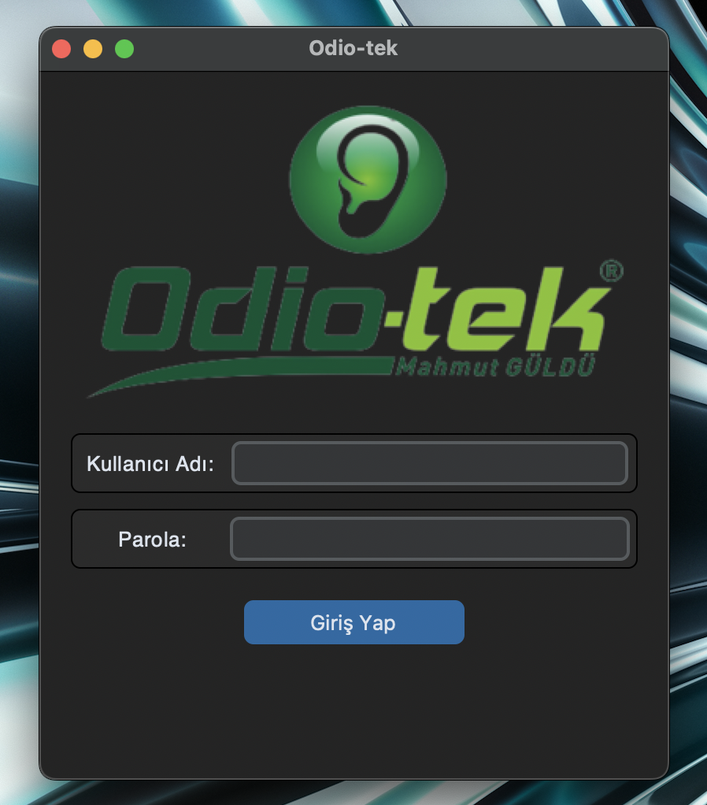
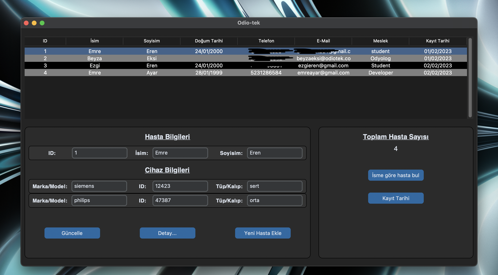
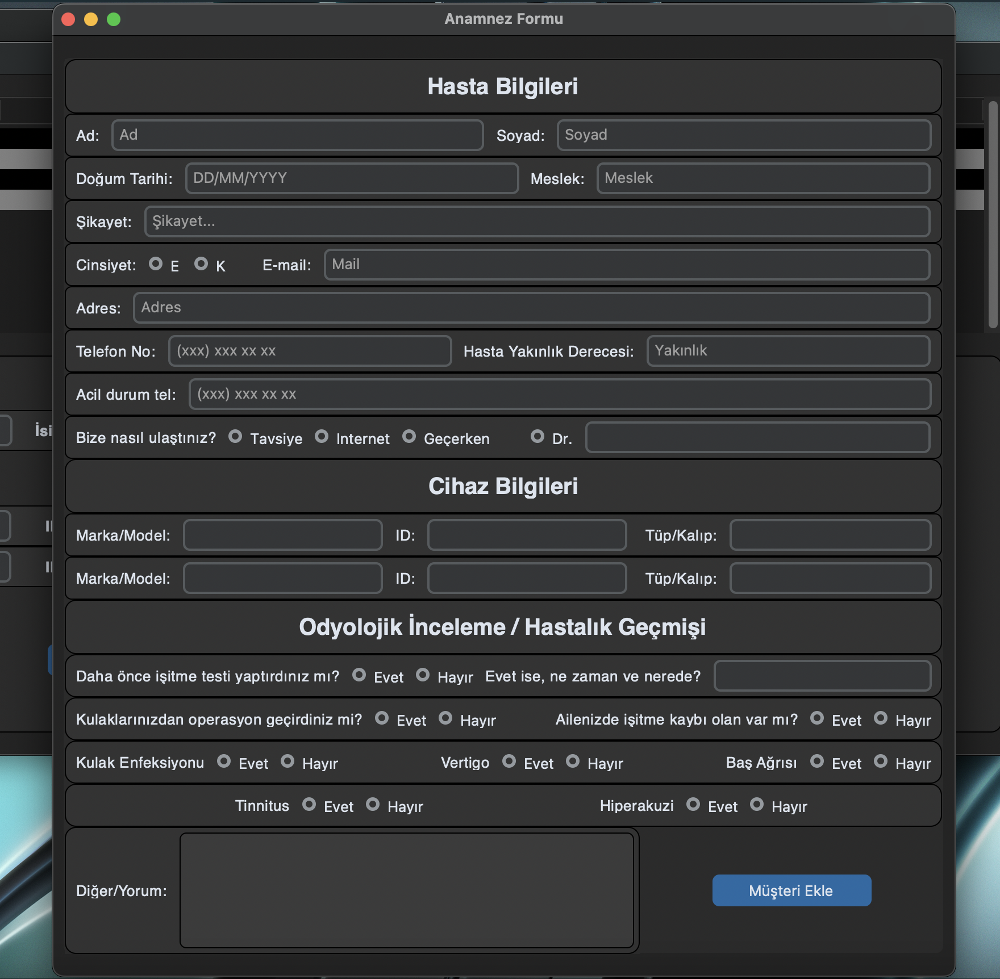
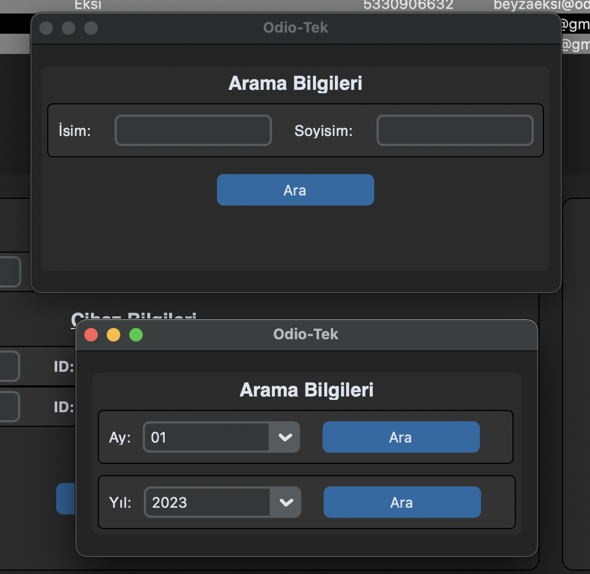

# Patient Recording System 
#### Video Demo:  https://youtu.be/W5h0KVn3J9U

## Description

- This is a GUI based patient recording system used with sqlite database.

I wanted to create a basic patient recording system for my family company, based on audiology. The audiologist of the company takes the patients information and fills a form. It is really hard and redundant to keep track of these forms after there are hundreds, thousands of forms.

I used a python UI-library called [customtkinter](https://github.com/TomSchimansky/CustomTkinter), which is a modern version of the built-in tkinter library. 

## Program Details

 - Program opens with a sign-in page as shown. It is a basic sign-in, prompts the user for a username and a password. It warns the user from the terminal if either username or password is wrong. When both correct, main page opens:

 

 - Main page consists of three frames consists of a treeview, patient information and search information.

 - Treeview shows some of the patient information that has been saved to database. When clicked, extra information about hearing aid device, whis is also included and fetched from the database, is shown in the patient information frame, automatically.

 - In the patient information frame, user can update ID, name, surname and hearing aid device information of the selected patient from the treeview, which updates both treeview and the database.

 - When clicked on detail button, screenshot of the selected patient's registry form is shown.

 
 Add new patient button opens a top-level page:
 
 

 

 - This form is filled when a new patient needs to be recorded. Most of the information is saved indivually into the database, but also the screenshot of the page is saved into another file.

 Search frame firstly shows the total amount of patient recorded to database, and allows search by name or by given date.

  

